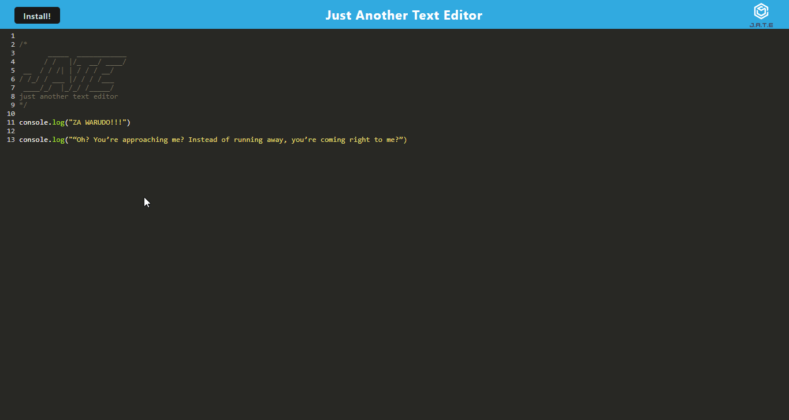

# PWA-Text-Editor

## Created By
   - 
   - Cory 
   - @MacaroniKetchup
## Table of Contents
  - [Description](#description)
  - [Installations](#installations)
  - [Usage](#usage)
  - [Contact-Info](#contact)
  - [Contributions](#contributions)
  - [Testing](#testing)
  
* [License](#license)

## Description
JATE (Just Another Text Editor) is a PWA application that allows the user to edit text or code snippets in the web application. BUT the user can also install the application to their own machine where it save the cached data from the application being used in the web browser to their local machine as well. So this application can then run while not being connected to any network!
## Installations
```
Below is a list of our dependancies and devDependancies in our ROOT level package.json
======================================================================================
  "dependencies": {
    "express": "^4.17.1"
  },
  "devDependencies": {
    "concurrently": "^5.2.0",
    "nodemon": "^2.0.4"
  }
======================================================================================

A list of our dependancies and devDependancies in our server folder level package.json
======================================================================================
  "dependencies": {
      "express": "^4.17.1"
  },
  "devDependencies": {
      "nodemon": "^2.0.4"
  }
======================================================================================

Lastly a list of our dependancies and devDependancies in our client folder level package.json
======================================================================================
  "devDependencies": {
    "@babel/core": "^7.15.0",
    "@babel/plugin-transform-runtime": "^7.15.0",
    "@babel/preset-env": "^7.15.0",
    "@babel/runtime": "^7.15.3",
    "babel-loader": "^8.2.2",
    "css-loader": "^6.2.0",
    "html-webpack-plugin": "^5.3.2",
    "http-server": "^0.11.1",
    "style-loader": "^3.2.1",
    "webpack": "^5.51.1",
    "webpack-cli": "^4.8.0",
    "webpack-dev-server": "^4.0.0",
    "webpack-pwa-manifest": "^4.3.0",
    "workbox-webpack-plugin": "^6.2.4"
  },
  "dependencies": {
    "code-mirror-themes": "^1.0.0",
    "idb": "^6.1.2"
  }
======================================================================================
```
## Usage
Click the link to [JATE: Just Another Text Editor](https://pure-beyond-85915.herokuapp.com/) that will take you to the application. You can then start typing any text or code snippets you want in the application. Then you can click the ```install``` button on the top left corner of the application screen. This will prompt the user if they wish to install the application to their local machine. Once installed you can then open the application at any time and type or edit away!

## Demo

## Contributors
If you would like to make contributions or edit this code on your own you can fork this project from the repo located on my GitHub profile. Or you can contact me via email, both of these will be located in the bottom of the README file or you can quick access my contact infrom via the table of contents.
## Contact-Info
- Name: Cory
- Email: stylesthestyer@gmail.com
- Github: [MacaroniKetchup](https://github.com/MacaroniKetchup/)
## Testing
```
No tests were written for this project
```
## License

      licensed under the MIT license.